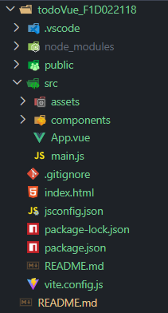
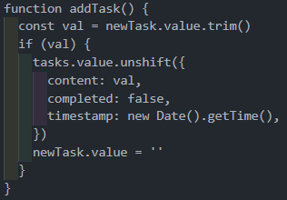
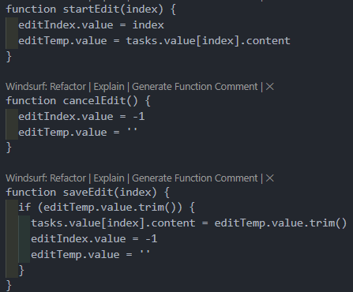
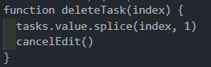
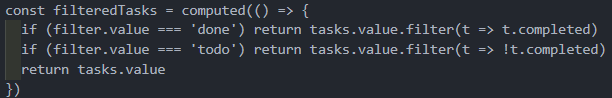
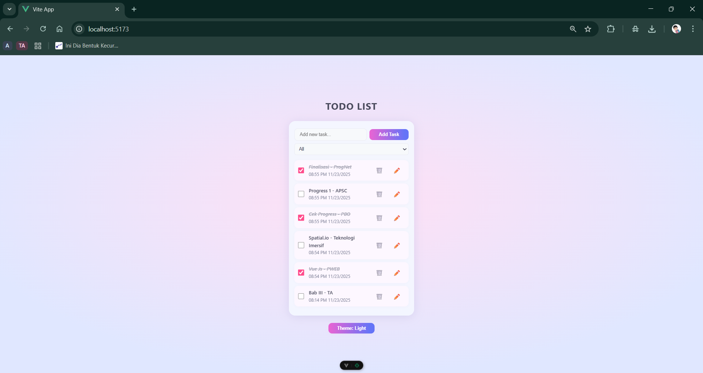
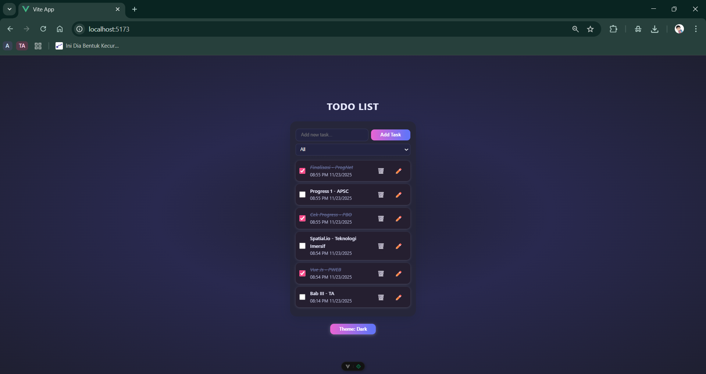
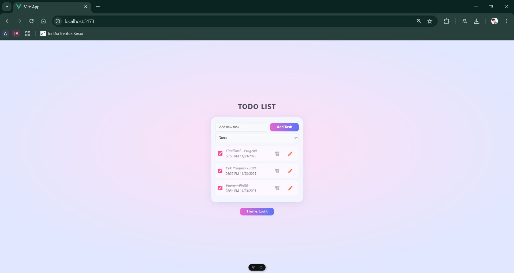
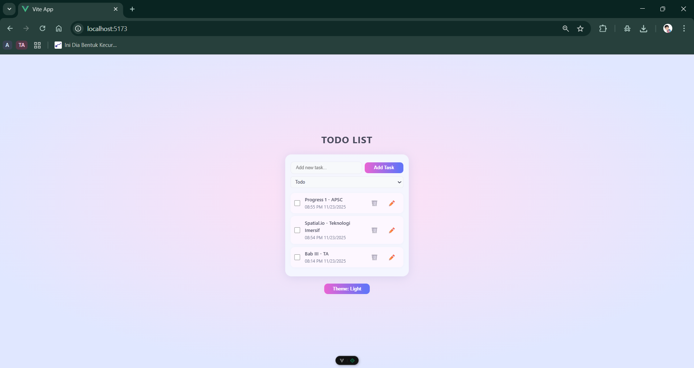
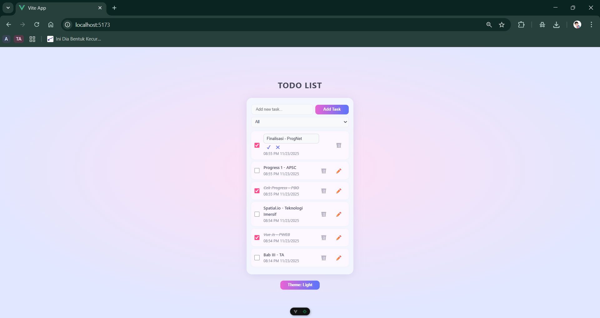

# Assignment: Vue.js – To-Do List

## Identitas

- Nama: Excel Caesariano
- NIM: F1D022118

---

## Deskripsi Aplikasi

Saya membangun aplikasi **To-Do List** menggunakan **Vue.js 3** dengan tampilan modern (inspirasi desain travel/booking apps).  
Fitur utama aplikasi:
- Menambah, mengedit, menghapus, dan menyelesaikan tugas dalam daftar to-do secara interaktif.
- Mendukung filter daftar: All, Done, Todo.
- Penyimpanan otomatis menggunakan LocalStorage (data tidak hilang saat browser di-refresh).
- Edit task secara inline dan tombol ceklis selesai.
- Mendukung light & dark mode yang dapat diaktifkan dari aplikasi.
- UI responsif dan elegan di layar desktop maupun mobile.

---

## Instalasi & Cara Menjalankan

1. **Clone repository ini:**
```git clone https://github.com/username/week12-vue-todo-list.git```

2. **Pindah ke directory ini:**
```cd week12-vue-todo-list```

2. **Install dependencies:**
```npm install```

3. **Jalankan aplikasi secara lokal:**
```npm run dev```

4. **Buka browser dan akses:**
```[http://localhost:5173](http://localhost:5173)```

---

## Struktur File Utama



---

## Penjelasan Singkat Fitur

- **Tambah Task:**  
Saat mengisi input lalu klik Add Task/tekan Enter, tugas baru akan langsung muncul di atas list dengan timestamp, status belum selesai.


- **Edit Task:**  
Klik dua kali pada nama tugas atau tombol pensil ✏️ untuk mengedit task secara inline, lalu tekan enter atau klik centang untuk konfirmasi.


- **Hapus dan Selesaikan Task:**  
Klik icon sampah 🗑️ untuk menghapus, atau ceklis untuk menandai sebagai selesai.  


- **Filter:**  
Gunakan dropdown untuk filter: All (semua tugas), Done (selesai), Todo (belum selesai).


- **LocalStorage:**  
Semua data tugas otomatis tersimpan di browser, aplikasi tetap ingat data saat di-refresh atau buka ulang.


- **Dark/Light Mode:**  
Dapat diubah via tombol Theme. Warna dan kontras otomatis menyesuaikan.

- **Responsif & Modern:**  
Layout menyesuaikan perangkat (mobile, tablet, desktop) dan tetap elegan.

---

## Screenshot Hasil Program

### Tampilan Desktop (Light Mode)


### Tampilan Desktop (Dark Mode)


### Tampilan Filter Done


### Tampilan Filter Todo


### Tampilan Edit Task


---